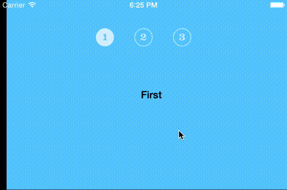

# README

This is the code repository accompanying the [Interactive Custom Container View Controller Transitions](http://www.iosnomad.com/blog/2014/5/12/interactive-custom-container-view-controller-transitions) blog post at [iOS Nomad](http://www.iosnomad.com).

The work is a continuation on the [Custom Container View Controller Transitions](http://www.objc.io/issue-12/custom-container-view-controller-transitions.html) article and code by [Joachim Bondo](https://github.com/osteslag), [issue #12](http://www.objc.io/issue-12) of the [objc.io publication](http://www.objc.io).

Following the steps already covered by [Joachim Bondo](https://github.com/osteslag), interactive transitions are added to the custom container view controller in four additional steps:

4. Adding a Gesture Recognizer: creating `PanGestureInteractiveTransition` to trigger an animated transition between child view controllers ([stage-4](https://github.com/mralek/custom-container-transitions/tree/stage-4), [diff](https://github.com/mralek/custom-container-transitions/compare/stage-3...stage-4))

5. Making it Interactive: [`AWPercentDrivenInteractiveTransition`](https://github.com/mralek/AWPercentDrivenInteractiveTransition) is added to the project and basic interaction is implemented. ([stage-5](https://github.com/mralek/custom-container-transitions/tree/stage-5), [diff](https://github.com/mralek/custom-container-transitions/compare/stage-4...stage-5))

6. Abort: Enabling cancellation of transitions ([stage-6](https://github.com/mralek/custom-container-transitions/tree/stage-6), [diff](https://github.com/mralek/custom-container-transitions/compare/stage-5...stage-6))

7. Delegation: Implementing delegation of interactive transitions ([stage-7](https://github.com/mralek/custom-container-transitions/tree/stage-7), [diff](https://github.com/mralek/custom-container-transitions/compare/stage-6...stage-7))

